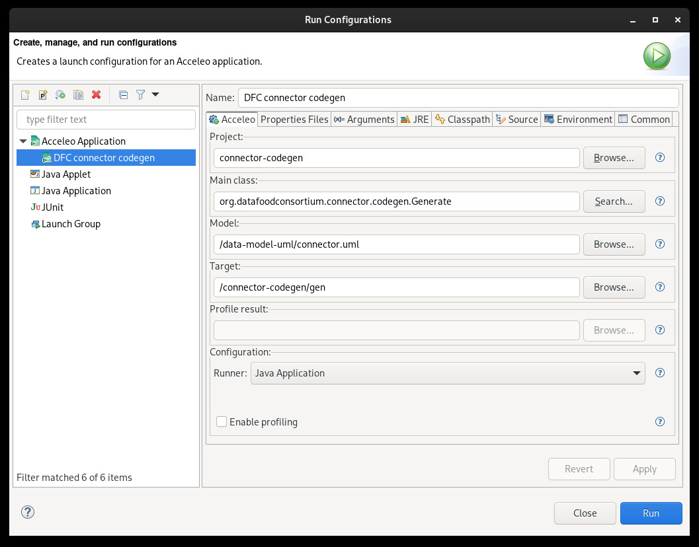
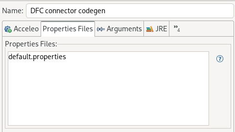

# Data Food Consortium connector code generator

This repository contains a [Acceleo](https://eclipse.dev/acceleo/) project to generate the source code of the DFC connector into all the supported programming languages.

## Introduction

The DFC connector is a tool designed to help developers to implement the DFC standard in their applications as they don't need to acquire any particular semantic web skills. It provides a library that developers can use to easily express semantic data conforming to the DFC ontology and taxonomies.

Like applications are developed in different programming languages, we need to provide the connector in various programming languages. The code generator allows us to easily produce a version of the connector for each programming language using only one source-of-truth.

The generator is a program capable to write source code (called "text") from a schema or plan (called "model"). This is called "model to text transformation" or "M2T". We choosed to use UML for our model which is described in the [model specifications]. To ease the M2T process we are using the [Acceleo framework](https://wiki.eclipse.org/Acceleo) within Eclipse.

This guide will lead you to setup the project so can you generate code. It will also give you some knowledges so can write you own generator.

## Getting started

You should install the Eclipse Modeling Tool, an Eclipse IDE version configured for modeling. Or you can add modeling tools to your current Eclipse installation. You will need the [Acceleo framework](https://wiki.eclipse.org/Acceleo) and the UML2 Eclipse plugin. To install them, you can use the Eclipse Marketplace following [this guide](https://wiki.eclipse.org/Acceleo/Installation).

Once you installed the required plugins, you will need to import this project into your Eclipse workspace. Clone this repo then click on `File > Open project from file system` and select the folder you just cloned.

In order to generate code, you will need the UML model itself. Clone the repository and import it in your Eclipse installation like you did before.

Finally, to launch the generation you will need a launch configuration. To create a new one in Eclipse, click on `Run > Run configurations...` and add a new Acceleo configuration. Like on the following picture:
- select the "connector-codegen" project;
- provide the "Generate" class;
- provide the UML model;
- and a folder in which to generate.



In the "Properties Files" tab, pass the `default.properties` file like on the following picture. The content of this file is detailed in the "Properties" section below.



The configuration is now ready, click on "Apply" and "Run".

## How Acceleo works

Acceleo uses dedicated template files (`.mtl`) which contain instructions on how to produce source code from the model. Acceleo provides a language to access elements of the model, being properties or methods: `[class.name /]` or `[class.getSomething() /]`.

With Acceleo you can also use the OCL language to get more complicated elements of the model like getting the input parameters of an operation: `[operation.getParameters()->select(p: Parameter | p.direction = ParameterDirectionKind::_in) /]`.

An Acceleo template looks like:
```
[template public generate(aClass: Class)]
    [class.name /]
[/template]
```

The content of the template is used to generate files. A `file` tag must be used like:

```
[file ('file.ext', false, 'UTF-8')]
...
[/file]
```

Acceleo provides a complete language with loops (`[for][/for]`), conditions (`[if][else][/if]`) and so on. You can read more about Acceleo on the [Eclipse wiki](https://wiki.eclipse.org/Acceleo) or in the help menu of Eclipse (click on `Help > Help contents`).

## Writing your own generator

To add a new generator, please follow these steps:

1. Create a new Java package inside the `org.datafoodconsortium.connector.codegen` package of the "src" folder. Name it as the programming language you are writing it for, like `org.datafoodconsortium.connector.codegen.java` if you want to generate Java source code. You can copy the code from an other package.

2. Be sure to call the main method of your generator in the `org::datafoodconsortium::connector::codegen::generate` .mtl file like `[generateJava(model)/]`.

3. Also if you want to have some static files copied to the output folder, create a new "static" folder inside your package and add your language in the `languages` array defined in the `copyStaticFiles` method of the `org.datafoodconsortium.connector.codegen.Generate` Java class: `String[] languages = new String[] { "php", "ruby", "java" };`.

4. Finally, define the `outputFolder_src` and the `outputFolder_test` properties in the `default.properties` file like:
```properties
java_outputFolder_src = java/src/
java_outputFolder_test = java/test/
```

Your new generator is now configured, you can launch the generation the same way as before.

### Queries

Acceleo queries are used to define complex expressions that can be used quickly at several locations in the generator.

The result of a query is stored in a cache, this way we can call several time the same query with the same parameters and the result will be only computed once.

The use of queries is **strongly encouraged**.

You will find predefined queries in the `queries.mtl` file contained in the `org.datafoodconsortium.connector.codegen` Java package.

| Query | Description |
| ----- | ----------- |
|`getAbstractClasses(model: Model): Bag(Class)`| Returns all the abstract classes of the model. |
|`getAdder(p: Parameter): Operation`| Returns the adder operation related to parameter. |
|`getAdder(p: Property): Operation`| Returns the adder operation related to the property. |
|`getClasses(model: Model): Bag(Class)`| Returns all the classes of the model. |
|`getClassifiers(model: Model): Bag(NamedElement)`| Returns all the classes and interfaces of the model. |
|`getConcreateClasses(model: Model): Bag(Class)`| Returns all the concreate classes of the model.  |
|`getConcreateSemanticClasses(model: Model): Bag(Class)`| Returns all the concreate classes of the model that are mapped to the DFC ontology. |
|`getConstructors(aClass: Class): OrderedSet(Operation)`| Returns all the contructor operations of a class. |
|`getDefaultConstructor(aClass: Class): Operation`| Returns the default contructor of a class. |
|`getDefaultConstructorParameters(aClass: Class): OrderedSet(Parameter)`| Returns the input parameters of the default constructor of a class. |
|`getDefaultConstructorParametersInitializer(aClass: Class): OrderedSet(Parameter)`| Returns all the initializer parameters of the default constructor of the class. |
|`getGetter(p: Parameter): Operation`| Returns the getter operation associated to the parameter.  |
|`getGetter(p: Property): Operation`| Returns the getter operation associated to the property. |
|`getImplementation(anElement: TypedElement, model: Model): Class`| Returns the class that implements the passed type. |
|`getImplementation(aType: Type, model: Model): Class`| Returns the class that implements the passed type. |
|`getImplementation(i: Interface, model: Model): Class`| Returns the (first-one) class that implements the passed interface. |
|`getImplementations(i: Interface, model: Model): Bag(Class)`| Returns the classes that implements the passed interface. |
|`getInitializedParentParameters(operation: Operation): OrderedSet(Parameter)`| For a constructor, returns the parameters that have already been initialized by the parent constructor. |
|`getInitializerProperty(p: Parameter): Property`| Returns the property (class variable) that the  parameter will initialize.  |
|`getInitializerPropertyGetter(p: Parameter): Operation`| Returns the getter operation of the property (class variable) that the parameter will initialize. |
|`getInputParameter(operation: Operation): Parameter`| Returns the input parameter of an operation. |
|`getInputParameterAt(operation: Operation, index: Integer): Parameter`| Returns the specified input parameter of an operation. |
|`getInputParameters(operation: Operation): OrderedSet(Parameter)`| Returns all the input parameters of an operation. |
|`getInterfaces(model: Model): Bag(Interface)`| Returns all the interfaces of the model. |
|`getMapping(element: Element): String`| Returns the mapped URI of the element. For instance, if you call this query on the `Address` class, it should returns `dfc-b:Address`.  |
|`getOperations(owner: Class): OrderedSet(Operation)`| Returns all the owned operations of the class. This won't return operations of inherited class or implemented interface(s). |
|`getPackageImports(model: Model): Set(PackageImport)`| Returns all the package imports of the model. |
|`getPackages(model: Model): Bag(Package)`| Returns all the packages imported by the model. |
|`getParameters(anOperation: Operation): OrderedSet(Parameter)`| Returns all the parameters of the operation. |
|`getProperties(aClass: Class): OrderedSet(Property)`| Returns all the properties (class variable) of the class. |
|`getProperty(anOperation: Operation, aClass: Class): Property`| Returns the property associated to the operation. The passed operation should be an adder, getter, setter or remover otherwise this query will return null. |
|`getRemover(p: Parameter): Operation`| Returns the getter operation associated to the parameter. |
|`getRemover(p: Property): Operation`| Returns the getter operation associated to the property. |
|`getReturnParameter(operation: Operation): Parameter`| Returns the returned parameter of the operation. |
|`getReturnParameterAt(operation: Operation, index: Integer): Parameter`| Returns the specified returned parameter of the operation. |
|`getReturnParameters(operation: Operation): OrderedSet(Parameter)`| Returns all the returned parameter of the operation. |
|`getSemanticVocabulary(m: Model): Set(String)`| Returns the semantic URI of all classes and properties (`dfc-b:Address`, `dfc-b:firstName`, etc). This could be used to generate a vocabulary library. |
|`getSemanticVocabularyOfClasses(m: Model): Set(String)`| Returns the semantic URI of all classes  (`dfc-b:Address`, `dfc-b:Catalog`, etc). |
|`getSemanticVocabularyOfProperties(m: Model): Set(String)`| Returns the semantic URI of all the properties (`dfc-b:firstName`, `dfc-b:lastName`, etc). |
|`getSetter(p: Parameter): Operation`| Returns the setter operation associated to the parameter. |
|`getSetter(p: Property): Operation`| Returns the setter operation associated to the property. |
|`getSkosBroader(p: Property): String`| Returns the URI of the SKOS Concept associated to the property. The returner URI might be prefixed. This is used to map taxonomy terms. Example of returned value: `dfc-m:AllergenDimension`. |
|`getStereotype(element: Element, qualifiedName: String): Stereotype`| Given a stereotype name, this query returns the stereotype applied on the element or null. |
|`getStereotypeAdder(e: Element): Stereotype`| Returns the `adder` stereotype applied to the element. Stereotypes are described in the [model specifications]. |
|`getStereotypeBlankNode(e: Element): Stereotype`| Returns the `blankNode` stereotype applied to the element. Stereotypes are described in the [model specifications]. |
|`getStereotypeConstructor(e: Element): Stereotype`| Returns the `constructor` stereotype applied to the element. Stereotypes are described in the [model specifications]. |
|`getStereotypeExternal(e: Element): Stereotype`| Deprecated. |
|`getStereotypeGetter(e: Element): Stereotype`| Returns the `getter` stereotype applied to the element. Stereotypes are described in the [model specifications]. |
|`getStereotypeInitializer(e: Element): Stereotype`| Returns the `initializer` stereotype applied to the element. Stereotypes are described in the [model specifications]. |
|`getStereotypeInitializerParent(e: Element): Stereotype`| Returns the `initializerParent` stereotype applied to the element. Stereotypes are described in the [model specifications]. |
|`getStereotypeNameAdder(traceabilityContext : OclAny): String`| Returns the name of the `adder` stereotype from the properties file. Stereotypes are described in the [model specifications]. |
|`getStereotypeNameBlankNode(traceabilityContext : OclAny): String`| Returns the name of the `blankNode` stereotype from the properties file. Stereotypes are described in the [model specifications] |
|`getStereotypeNameConstructor(traceabilityContext : OclAny): String`| Returns the name of the `constructor` stereotype from the properties file. Stereotypes are described in the [model specifications]. |
|`getStereotypeNameExternal(traceabilityContext : OclAny): String`| Deprecated. |
|`getStereotypeNameGetter(traceabilityContext : OclAny): String`| Returns the name of the `getter` stereotype from the properties file. Stereotypes are described in the [model specifications]. |
|`getStereotypeNameInitializer(traceabilityContext : OclAny): String`| Returns the name of the `initializer` stereotype from the properties file. Stereotypes are described in the [model specifications]. |
|`getStereotypeNameInitializerParent(traceabilityContext : OclAny): String`| Returns the name of the `initializerParent` stereotype from the properties file. Stereotypes are described in the [model specifications]. |
|`getStereotypeNameProperty(traceabilityContext : OclAny): String`| Returns the name of the `property` stereotype from the properties file. Stereotypes are described in the [model specifications]. |
|`getStereotypeNamePropertyMultiple(traceabilityContext : OclAny): String`| Returns the name of the `propertyMultiple` stereotype from the properties file. Stereotypes are described in the [model specifications]. |
|`getStereotypeNameRemover(traceabilityContext : OclAny): String`| Returns the name of the `remover` stereotype from the properties file. Stereotypes are described in the [model specifications]. |
|`getStereotypeNameSemantic(traceabilityContext : OclAny): String`| Returns the name of the `semantic` stereotype from the properties file. Stereotypes are described in the [model specifications]. |
|`getStereotypeNameSetter(traceabilityContext : OclAny): String`| Returns the name of the `setter` stereotype from the properties file. Stereotypes are described in the [model specifications] |
|`getStereotypeNameSkosBroader(traceabilityContext : OclAny): String`| Returns the name of the `skosBroader` stereotype from the properties file. Stereotypes are described in the [model specifications]. |
|`getStereotypeProperty(e: Element): Stereotype`| Returns the `property` stereotype applied to the element. Stereotypes are described in the [model specifications]. |
|`getStereotypePropertyMultiple(e: Element): Stereotype`| Returns the `propertyMultiple` stereotype applied to the element. Stereotypes are described in the [model specifications]. |
|`getStereotypePropertyNameInitializerProperty(traceabilityContext : OclAny): String`| Returns the name of the `property` attribute of the `initializer` stereotype from the properties file. Stereotypes and their attributes are described in the [model specifications]. |
|`getStereotypePropertyNamePropertyGetter(traceabilityContext : OclAny): String`| Returns the name of the `getter` attribute of the `property` stereotype from the properties file. Stereotypes and their attributes are described in the [model specifications]. |
|`getStereotypePropertyNamePropertyMultipleAdder(traceabilityContext : OclAny): String`| Returns the name of the `adder` attribute of the `propertyMultiple` stereotype from the properties file. Stereotypes and their attributes are described in the [model specifications]. |
|`getStereotypePropertyNamePropertyMultipleRemover(traceabilityContext : OclAny): String`| Returns the name of the `remover` attribute of the `propertyMultiple` stereotype from the properties file. Stereotypes and their attributes are described in the [model specifications]. |
|`getStereotypePropertyNamePropertySetter(traceabilityContext : OclAny): String`| Returns the name of the `setter` attribute of the `property` stereotype from the properties file. Stereotypes and their attributes are described in the [model specifications]. |
|`getStereotypePropertyNameSemanticMap(traceabilityContext : OclAny): String`| Returns the name of the `map` attribute of the `semantic` stereotype from the properties file. Stereotypes and their attributes are described in the [model specifications]. |
|`getStereotypePropertyNameSkosBroaderMap(traceabilityContext : OclAny): String`| Returns the name of the `map` attribute of the `skosBroader` stereotype from the properties file. Stereotypes and their attributes are described in the [model specifications]. |
|`getStereotypeRemover(e: Element): Stereotype`| Returns the `remover` stereotype applied to the element. Stereotypes are described in the [model specifications]. |
|`getStereotypeSemantic(e: Element): Stereotype`| Returns the `semantic` stereotype applied to the element. Stereotypes are described in the [model specifications]. |
|`getStereotypeSetter(e: Element): Stereotype`| Returns the `setter` stereotype applied to the element. Stereotypes are described in the [model specifications]. |
|`getStereotypeSkosBroader(e: Element): Stereotype`| Returns the `skosBroader` stereotype applied to the element. Stereotypes are described in the [model specifications]. |
|`getStereotypeValueInitializerParentProperty(e: Element): Property`| Returns the value of `property` attribute of the `initializerParent` stereotype applied to the element. Stereotypes and their attributes are described in the [model specifications]. |
|`getStereotypeValueInitializerProperty(e: Element): Property`| Returns the value of `property` attribute of the `initializer` stereotype applied to the element. Stereotypes and their attributes are described in the [model specifications]. |
|`getStereotypeValuePropertyGetter(e: Element): Operation`| Returns the value of `getter` attribute of the `property` stereotype applied to the element. Stereotypes and their attributes are described in the [model specifications]. |
|`getStereotypeValuePropertyMultipleAdder(e: Element): Operation`| Returns the value of `adder` attribute of the `propertyMultiple` stereotype applied to the element. Stereotypes and their attributes are described in the [model specifications]. |
|`getStereotypeValuePropertyMultipleGetter(e: Element): Operation`| Returns the value of `getter` attribute of the `propertyMultiple` stereotype applied to the element. Stereotypes and their attributes are described in the [model specifications]. |
|`getStereotypeValuePropertyMultipleRemover(e: Element): Operation`| Returns the value of `remover` attribute of the `propertyMultiple` stereotype applied to the element. Stereotypes and their attributes are described in the [model specifications]. |
|`getStereotypeValuePropertyMultipleSetter(e: Element): Operation`| Returns the value of `setter` attribute of the `propertyMultiple` stereotype applied to the element. Stereotypes and their attributes are described in the [model specifications]. |
|`getStereotypeValuePropertySetter(e: Element): Operation`| Returns the value of `setter` attribute of the `property` stereotype applied to the element. Stereotypes and their attributes are described in the [model specifications]. |
|`getStereotypeValueSemanticMap(e: Element): String`| Returns the value of `map` attribute of the `semantic` stereotype applied to the element. Stereotypes and their attributes are described in the [model specifications]. |
|`getStereotypeValueSkosBroaderMap(e: Element): String`| Returns the value of `map` attribute of the `skosBroader` stereotype applied to the element. Stereotypes and their attributes are described in the [model specifications]. |
|`getTestValues(ps: Sequence(Parameter)): Sequence(String)`| Generates a random test value for each passed parameter. |
|`getUninitializedParentParameters(operation: Operation): OrderedSet(Parameter)`| For a constructor, returns the parameters not initalized by its parent. |
|`hasConstructor(aClass: Class): Boolean`| Tells whether or not a class has a constructor method. |
|`hasGeneralization(classifier: Classifier): Boolean`| Tells whether or not a class or interface is inherited. |
|`hasInitializedParentParameters(operation: Operation): Boolean`| For a constructor, tells whether or not its parameters have already been initialized by its parent. |
|`hasInputParameter(operation: Operation): Boolean`| Tells whether or not an operation takes parameters. |
|`hasOwnedOperations(aClass: Class): Boolean`| Tells whether or not a class has owned operation (operations not inherited). |
|`hasReturnParameter(operation: Operation): Boolean`| Tells whether or not an operation return something. |
|`hasStereotype(element: Element, qualifiedName: String): Boolean`| Tells whether or not the stereotype is applied on the element. |
|`hasUninitializedParentParameters(operation: Operation): Boolean`| For a constructor, tells whether or not it has some parameters to initialize. |
|`initResources(traceabilityContext : OclAny): Boolean`| This should be called by the main generator to initialize the UML resources. |
|`isAdder(o: Operation): Boolean`| Tells whether or not the operation is used to add a value to a collection. |
|`isBlankNode(e: Element): Boolean`| Tells whether or not the element is a blank node. |
|`isBlankNode(parameter: Parameter): Boolean`| Tells whether or not the parameter targets a blank node. |
|`isCollection(anElement: MultiplicityElement): Boolean`| Tells whether or not the element is a collection like a list or array of some values. |
|`isConstructor(o: Operation): Boolean`| Tells whether or not the operation is a constructor. |
|`isExternal(e: Element): Boolean`| Deprecated. |
|`isGetter(o: Operation): Boolean`| Tells whether or not the operation is used to get a value. |
|`isInitializer(p: Parameter): Boolean`| Tells whether or not the parameter is used to initialize a class variable. |
|`isInitializerParent(p: Parameter): Boolean`| Tells whether or not the parameter is used to initialize a class variable of the parent class. |
|`isPrimitive(anElement: TypedElement): Boolean`| Tells whether or not the element is a primitype type (String, Boolean, Integer, Float). |
|`isPrimitive(t: Type): Boolean`| Tells whether or not the type is a primitype (String, Boolean, Integer, Float). |
|`isProperty(p: Property): Boolean`| Tells whether or not the property is a class variable. |
|`isPropertyMultiple(p: Property): Boolean`| Tells whether or not the property is a collection class variable (en: array). |
|`isRemover(o: Operation): Boolean`| Tells whether or not the operation is used to remove an element from a list. |
|`isSemantic(e: Element): Boolean`| Tells whether or not the element is mapped to a semantic resource. |
|`isSetter(o: Operation): Boolean`| Tells whether or not the operation is used to set a value. |
|`isSkosBroaderConstrained(p: Property): Boolean`| Tells whether or not the operation is a constructor. |

## Properties

Properties files are standard Java ".properties" files that can be loaded by an Acceleo generator to customize a generation.

This project uses such properties, located in the `default.properties` file.

In order to generate, this file MUST be loaded in the launch configuration or passed as a command line argument.

| Property | Description |
| -------- | ----------- |
| `<language>_outputFolder_src` | Defines the folder in which the source code will be generated for the targeted language. Ex: `php_outputFolder_src = php/src/`. |
| `<language>_outputFolder_test` | Defines the folder in which the tests will be generated for the targeted language. Ex: `php_outputFolder_test = php/test/`. |
| `stereotype<StereotypeName>` | In the generator we need to get data associated to certain stereotypes like the name of a getter method for instance. This property points to the location of the corresponding stereotype in the UML model. Ex: `stereotypeGetter = datafoodconsortium_connector::getter`. |
| `stereotype<StereotypeName>_<property>` | In the generator we need to get data associated to certain properties of stereotypes like the name of the mapping property for instance. This property points to the name of the corresponding property in the UML model. Ex: `stereotypeSemantic_map = map`. |
| `context_<prefix>` | Defines the URI of the semantic prefix. Ex: `context_dfcB = https://...`. |

[model specifications]: https://datafoodconsortium.gitbook.io/dfc-standard-documentation/connector/model-specifications